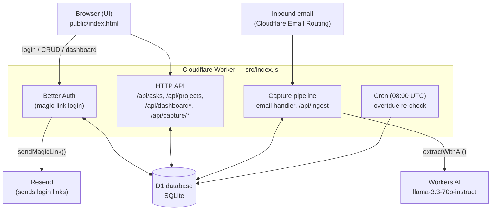
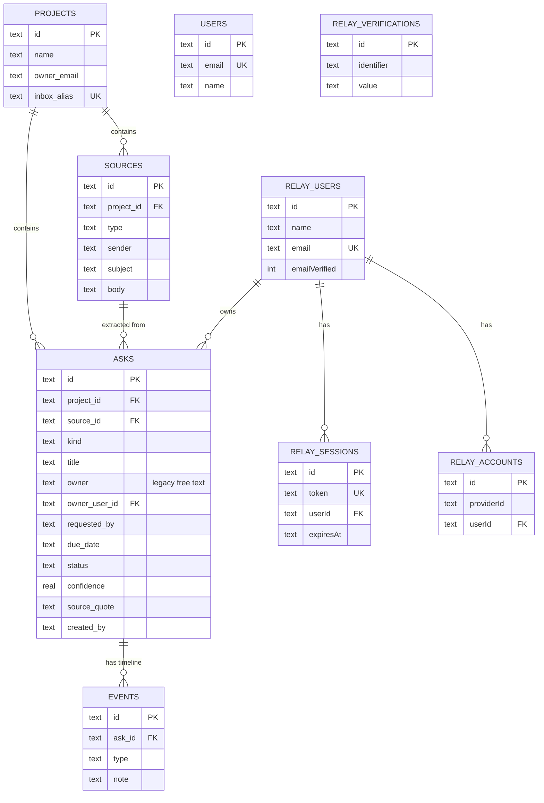

# Relay — Αρχιτεκτονική & Τεχνολογίες

*Snapshot κατάστασης: 6 Σεπτεμβρίου 2026 (βάσει `relay.zip`). Live στο `https://kafkas-relay.pages.dev/`.*

---

## 1. Τι είναι το Relay (σε μία πρόταση)

Project tracking που «γεμίζει μόνο του»: στέλνεις email ή κάνεις paste κείμενο, το Relay εντοπίζει τις δεσμεύσεις («asks» — ποιος χρωστάει τι, σε ποιον, μέχρι πότε) και τις κρατάει σε ένα dashboard με reporting, charts και exports.

---

## 2. Τεχνολογική στοίβα

| Επίπεδο | Τεχνολογία | Ρόλος |
|---|---|---|
| Runtime | **Cloudflare Workers** | Ένα αρχείο (`src/index.js`), ένας handler (`fetch` / `email` / `scheduled`). Χωρίς framework (όχι Hono, όχι itty-router). |
| Database | **Cloudflare D1** (SQLite) | Όλα τα δεδομένα: projects, sources, asks, events, users, auth tables. |
| AI εξαγωγή | **Workers AI** — `@cf/meta/llama-3.3-70b-instruct-fp8-fast` | Εξαγωγή asks από ελεύθερο κείμενο (`extractWithAI`), με fallback σε heuristic parser (`naiveExtract`) αν δεν υπάρχει AI binding. Επίσης παράγει το AI Executive Summary και τα AI Insights. |
| Auth | **Better Auth 1.7.1** + plugin `magicLink` | Passwordless login μέσω email. Χρησιμοποιεί απευθείας το `env.DB` binding, χωρίς ξεχωριστό adapter. |
| Outbound email | **Resend API** | Το Cloudflare Email Routing είναι μόνο inbound — το Resend στέλνει το magic-link email. |
| Inbound email | **Cloudflare Email Routing** + **postal-mime** | Catch-all κανόνας σε (sub)domain → Worker `email` handler → parsing με `postal-mime`. |
| Frontend | **Vanilla JS**, ένα αρχείο `public/index.html` | Χωρίς build step, χωρίς framework. |
| Charts | **Chart.js** (CDN) | Donut status + stacked bar ανά owner στο dashboard. |
| Excel export | **SheetJS (xlsx)** (CDN) | 4-sheet `.xlsx` export. |
| PPT export | **PptxGenJS** (CDN) | 5-slide `.pptx`, με screenshots των live canvas charts. |
| Config | `wrangler.jsonc` | D1 binding, AI binding (`remote:true`), assets binding, cron trigger, vars. |
| Tooling | **Wrangler CLI** | dev / deploy / d1 execute. |

**Σημαντικό σχεδιαστικό χαρακτηριστικό:** το project είναι σκόπιμα single-file / no-framework — «MVP starter» φτιαγμένο να διαβάζεται και να γίνεται deploy εύκολα.

---

## 3. Αρχιτεκτονικό διάγραμμα (ροή δεδομένων)

**Ροή "capture-by-email" (η κύρια ιδέα του προϊόντος):**

1. Κάποιος στέλνει email στο `<alias>@<domain>` (π.χ. `demo@in.relay.app`).
2. Cloudflare Email Routing προωθεί το μήνυμα στον Worker (`email` handler).
3. Το `postal-mime` κάνει parse το raw email.
4. Το `local part` της διεύθυνσης (π.χ. `demo`) γίνεται το project alias.
5. Το κείμενο περνάει από `extractItems()` → `extractWithAI()` (Workers AI) ή `naiveExtract()` (fallback χωρίς AI).
6. Κάθε εξαγόμενο αντικείμενο αποθηκεύεται ως `ask`, με σύνδεση στο αρχικό `source`.
7. Cron καθημερινά στις 08:00 UTC ξανακοιτάει τα `due_date` και σημαδεύει `overdue`.

**Κρίσιμος περιορισμός:** το `email` handler και το `/api/ingest` **δεν** προστατεύονται από login — πυροδοτούνται από την υποδομή mail του Cloudflare, όχι από logged-in χρήστη.

---

## 4. Data model (ERD)

> **Σημείωση:** υπάρχουν αυτή τη στιγμή **δύο** παράλληλα user tables: το εφαρμογικό `users` (Phase A, id = email) και το `relay_users` του Better Auth (Phase B, δικό του id scheme). Το `RELAY-AUTH-PHASE-PLAN.md` προτείνει να συγκλίνουν σε ένα — αυτό είναι ανοιχτό θέμα (βλ. §6 «Επόμενα βήματα»).

---

## 5. API επιφάνεια (endpoints)

| Endpoint | Method | Auth | Σκοπός |
|---|---|---|---|
| `/api/auth/*` | GET/POST | — (το ίδιο είναι το auth) | Better Auth handler: sign-in/magic-link, get-session, sign-out |
| `/api/projects` | GET, POST | ✅ session | Λίστα / δημιουργία project |
| `/api/projects/:id` | DELETE | ✅ session | Διαγραφή project |
| `/api/asks` | GET, POST | ✅ session | Λίστα (με φίλτρα project/status) / χειροκίνητη δημιουργία ask |
| `/api/asks/:id` | PUT, DELETE | ✅ session + ownership check | Επεξεργασία / διαγραφή — μόνο ο `created_by` |
| `/api/asks/:id/status` | POST | ✅ session | Γρήγορη αλλαγή status |
| `/api/dashboard` | GET | ✅ session | Aggregated στατιστικά ανά project |
| `/api/dashboard/summary` | GET | ✅ session | AI Executive Summary (Workers AI, με non-AI fallback) |
| `/api/dashboard/insights` | GET | ✅ session | AI insights: overdue / blocked / χωρίς owner |
| `/api/capture/preview` | POST | ✅ session | Preview εξαγωγής asks από επικολλημένο κείμενο, πριν το commit |
| `/api/capture/commit` | POST | ✅ session | Οριστική αποθήκευση των preview asks |
| `/api/ingest` | POST | ❌ **σκόπιμα ανοιχτό** | Server-side ingest κειμένου, χωρίς session |
| `email` handler | — | ❌ **σκόπιμα ανοιχτό** | Inbound capture-by-email |
| `scheduled` (cron) | — | — | Καθημερινό re-check overdue, 08:00 UTC |

---

## 6. Κατάσταση Auth Migration (Phases A–F)

Βάσει `RELAY-AUTH-PHASE-PLAN.md` και του πραγματικού κώδικα:

| Phase | Περιγραφή | Κατάσταση |
|---|---|---|
| **A** | Users table + backfill από `asks.owner` | ✅ Έγινε (`migrate_add_users.sql`, `owner_user_id` FK) |
| **B** | Better Auth wiring (magic link, Resend) | ✅ Έγινε (`createAuth()`, `relay_users/sessions/accounts/verifications`) |
| **C** | Route protection + login UI | ✅ Έγινε (`requireSession`, login form στο `index.html`, dev-mode bypass σε localhost) |
| **D** | Owner picker αντί για free text + "claim" flow | ⏳ **Δεν έχει γίνει** — το πεδίο `owner` παραμένει ελεύθερο κείμενο στο UI |
| **E** | Απόφαση: single-owner ή multi-user project | ⏳ **Εκκρεμεί ως product decision** — δεν υπάρχει `project_members` table |
| **F** | Migration στο production + καθάρισμα legacy owner UI | ⏳ Μερικώς — τα migrations έχουν τρέξει, αλλά το free-text owner UI δεν έχει αφαιρεθεί |

---

## 7. Λειτουργικοί περιορισμοί (μην τους σπάσεις κατά λάθος)

- Ποτέ auth check μπροστά από τον `email` handler ή το `/api/ingest`.
- Migrations πάντα additive (`ALTER TABLE ADD COLUMN`, `CREATE TABLE IF NOT EXISTS`) — ποτέ destructive rewrite σε production data.
- `wrangler dev` χρειάζεται `"remote": true` στο `ai` binding, αλλιώς μπορεί να κάνει crash/restart.
- Deploy πάντα από τον σωστό/ενημερωμένο φάκελο — αλλιώς σερβίρεται stale code.
- D1 migrations σε production χρειάζονται `--remote`.
